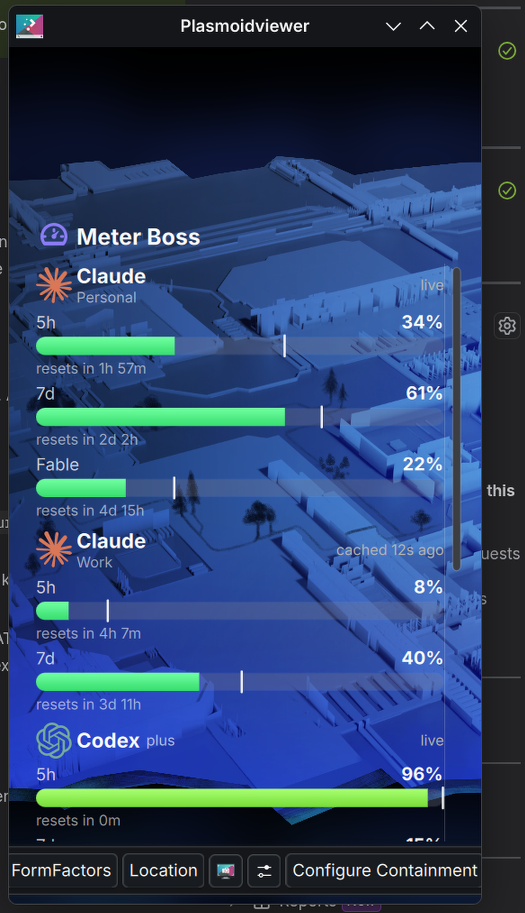

# AI Meter

A KDE Plasma 6 panel widget that shows **every AI subscription meter** you have: any number of
Claude accounts, OpenAI Codex, SuperGrok, Cursor: as compact bars, plus an optional Android
home-screen widget ("Pocket Meter") fed by push.


One collector, shared by the panel and the phone job, so provider APIs get polled once no matter
how many surfaces are watching. Read-only status checks: zero tokens spent, zero prompts sent.



AI Meter supersedes four earlier single-provider widgets (Claude Meter, Codex Meter, Grok Meter,
Cursor Meter) and the standalone Pocket Meter app. See [Migrating](#migrating-from-the-old-widgets)
below if you're coming from one of those.

## Supported providers

| Type | What it reads | Endpoint | Auth |
|---|---|---|---|
| **Claude** | 5h / 7d subscription windows, optional per-model weekly window | Claude Code OAuth token, then the claude.ai usage endpoint, then an offline statusline snapshot | Claude Code's stored token, or your browser's claude.ai session cookie (decrypted in memory from KWallet / Secret Service) |
| **Codex** | 5h / 7d subscription windows | ChatGPT usage endpoint, then the newest Codex session rollout | Codex CLI's stored OAuth token |
| **SuperGrok** | Weekly credit pool, Grok Build share | `cli-chat-proxy.grok.com` | Grok CLI's stored token |
| **Cursor** | Monthly Models / Other Models pools, Grok Bot weekly usage | Cursor's dashboard API | Cursor's stored access token (CLI or IDE) |

All four hit a zero-quota read endpoint: checking usage never counts against the usage it's
checking. Every token is read from local files and used **in memory only**: nothing is written to
disk beyond an optional offline fallback snapshot each provider already keeps for itself. Details
per provider, including every fallback and env override: [`docs/providers.md`](docs/providers.md).

## Install

```bash
git clone https://github.com/matpb/ai-meter.git
cd ai-meter
./install.sh
```

This installs the plasmoid, links the `ai-meter` CLI into `~/.local/bin`, auto-detects your
subscriptions into a starter config, and installs (but doesn't enable) the push timer. Then either
say yes when it offers to add the widget to your panel, or add it by hand: right-click your panel
→ **Add Widgets…** → search **AI Meter**.

Options:

```
install.sh [--no-plasma] [--no-systemd] [--help]
```

- `--no-plasma`: skip `kpackagetool6`/`plasmashell`, just copy the plasmoid package where the CLI
  symlink expects it. Useful for a headless check of the collector alone.
- `--no-systemd`: skip installing/enabling the push timer.

## Update

```bash
cd ai-meter
git pull
./install.sh
```

Re-running is safe (idempotent). If the panel looks stale after an update, restart the shell:

```bash
(plasmashell --replace &>/dev/null &) # restarts the Plasma shell
```

## Uninstall

```bash
./uninstall.sh
```

Then right-click the widget in your panel → **Remove**. Your config and cached state under
`~/.config/ai-meter/` and `~/.local/state/ai-meter/` are left alone; `uninstall.sh` prints their
paths and how to clear them if you want a clean slate.

## Configure

Right-click the widget → **Configure AI Meter…**:

- **Meters**: add a subscription (`+ Add subscription`), pick its type, and set per-meter options:
  label, sub-label (e.g. an account name), whether it shows in the panel, whether it's sent to the
  phone, which bars are shown, a custom icon, and type-specific account options: e.g. a second
  Claude account through its own Claude Code directory (e.g. `~/.claude-work`) and Chrome profile.
- **Appearance**: whether the AI Meter icon always shows, panel tinting, window labels, how many
  bars each pinned subscription gets in the panel, and the refresh interval.

The config file `~/.config/ai-meter/config.json` is the source of truth for all of this and can be
edited by hand: the widget just calls `ai-meter config get` / `config set` under the hood. Format:
[`docs/contract.md`](docs/contract.md).

### CLI

| Command | Does |
|---|---|
| `ai-meter snapshot [--max-age N]` | Return the cached snapshot if fresh (default 60s), else collect |
| `ai-meter collect` | Collect now, ignoring the cache |
| `ai-meter push [--force]` | Send the phone payload via FCM if changed, forced, or 15 minutes stale |
| `ai-meter config get` | Print the current (or auto-detected) config |
| `ai-meter config set` | Read config JSON from stdin (or `--b64 <base64>`), validate, write it |
| `ai-meter config init` | Write an auto-detected config, only if none exists yet |
| `ai-meter profiles` | List discoverable Chromium cookie databases, for a second Claude account |

## How it works

```
providers/*.sh ──► ai-meter (collector, flock + max-age cache) ──► snapshot.json
                                                 │                      ├─► Plasma widget (runs `ai-meter snapshot`)
                                                 └─► ai-meter push ───┴─► FCM topic ──► Android widget
```

One collector script per meter type, run under a shared `flock` with a max-age cache, so the panel
polling every refresh interval and the phone's push timer never double-hit a provider's API. Full
contract (paths, config schema, snapshot schema, push payload): [`docs/contract.md`](docs/contract.md).

## Phone (optional)

An Android home-screen widget, "Pocket Meter", fed by Firebase Cloud Messaging: no persistent
notification, no VPN, no always-on connection. Set-up is a bit more involved (your own Firebase
project): see [`docs/phone.md`](docs/phone.md).

## Migrating from the old widgets

If you're coming from Claude Meter, Codex Meter, Grok Meter, Cursor Meter, or Pocket Meter:

1. Install AI Meter (above).
2. Recreate each subscription in **Configure → Meters**. A second Claude account maps to its own
   Claude Code directory (e.g. `~/.claude-work`) and Chrome profile, same as it did before.
3. Remove the old widget(s) from your panel (right-click → Remove).
4. Uninstall each old widget with its own `uninstall.sh` in its repo.
5. If you used Pocket Meter: its hub timer and ntfy/UnifiedPush wiring are no longer needed. AI
   Meter's phone widget uses its own Firebase project and FCM topic instead: see
   [`docs/phone.md`](docs/phone.md).

## Privacy

Nothing leaves your machine except the provider API calls each meter needs (and only for the
accounts you've configured), and, if you enable the phone widget, the usage percentages sent
through your own Firebase project. No analytics, no telemetry, no third-party server in between.

## Disclaimer

This is an **unofficial** tool, not affiliated with or endorsed by Anthropic, OpenAI, xAI, or
Cursor / Anysphere. It reads usage through each provider's own stored credentials and, for Claude,
an undocumented endpoint using your logged-in session: either could change at any time. Use it for
your own accounts only.

## License

MIT: see [LICENSE](LICENSE). Mathieu-Philippe Bourgeois · https://matpb.com
